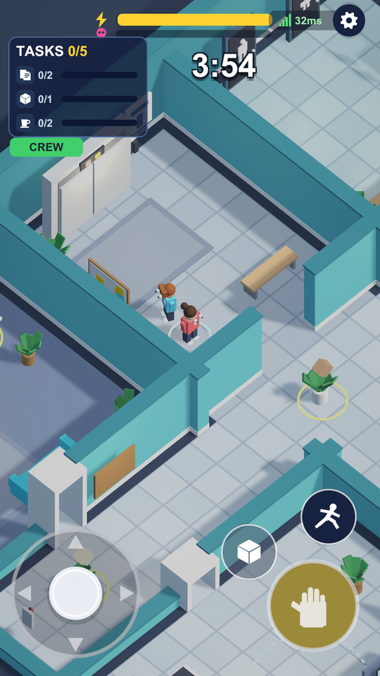
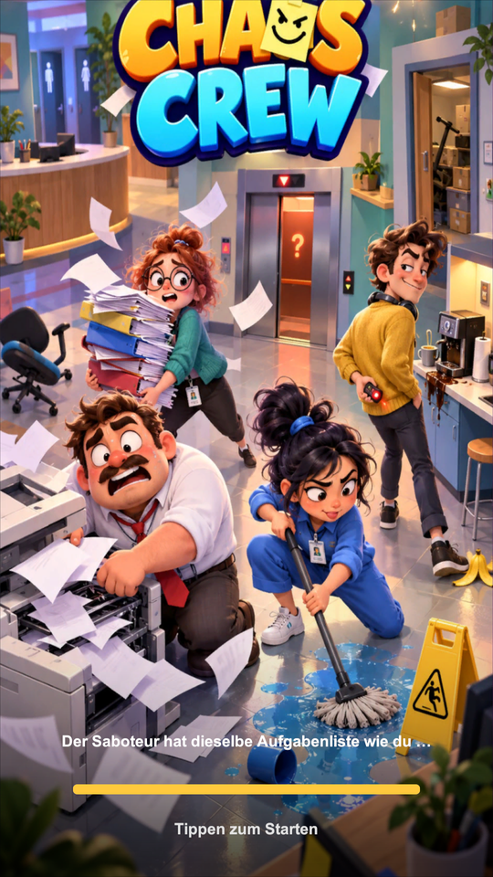
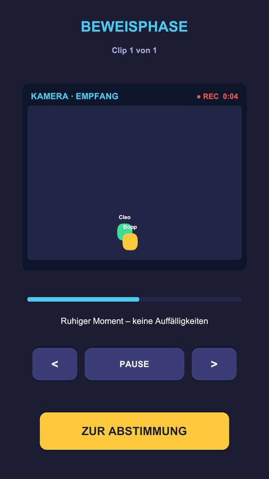

# Chaos Crew

Ein Social-Deduction-Spiel für vier Spieler im Hochformat. Drei Kolleg:innen arbeiten ein
Büro ab, eine Person sabotiert heimlich. Am Rundenende sichtet die Crew
Überwachungsaufnahmen und stimmt ab, wer es war.

Unity 6000.6.0f1 · URP · neues Input System · isometrische 3D-Ansicht · Mobile Portrait.

<p align="left">
  
  
  
</p>

## Starten

1. Projekt in Unity 6000.6 öffnen, eine beliebige Szene laden (z. B. `Assets/Scenes/SampleScene.unity`).
2. **Play** drücken — mehr ist nicht nötig.
3. Game-View auf Hochformat stellen, z. B. `1080 x 1920`.

Das Spiel baut sich beim Start vollständig per Code auf (`Bootstrap.cs` mit
`RuntimeInitializeOnLoadMethod`): Büro, Möbel, Figuren, Licht, Kamera und UI entstehen zur
Laufzeit aus Unity-Primitiven. Es gibt **keine Prefabs und keine Szenen-Verkabelung**, die
kaputtgehen könnten. Einziges Binär-Asset im Spiel ist das Key Art des Ladebildschirms.

## Spielprinzip

Ladebildschirm → Titel → Lobby (füllt sich mit 3 Bots) → Rollenvergabe → Runde (4 min) →
Beweisphase → Abstimmung (25 s) → Ergebnis.

* **Crew gewinnt**, wenn alle Aufgaben fertig sind *oder* der Saboteur rausgewählt wird.
* **Saboteur gewinnt**, wenn der Chaos-Balken volläuft *oder* er unerkannt bleibt.

Erledigte Aufgaben senken den Chaos-Balken, Sabotagen heben ihn — beide Siegbedingungen
hängen am selben Balken und ziehen gegeneinander.

### Beweisphase

Während der Runde werden alle Positionen mit 5 Hz mitgeschnitten, aber nur Räume **mit
Kamera** lassen sich später zu Clips machen. `Lager`, `Toiletten` und `Aufzug` sind blinde
Flecken. Nach der Runde zeigt das Spiel die drei interessantesten Momente als abspielbare
Clips.

Der Saboteur hat zwei Werkzeuge dagegen:

* **Kamera stören** — die Aufnahme im aktuellen Raum wird für 10 Sekunden zu Rauschen.
* **Falsche Spur** — die nächste Tat erscheint im Clip unter der Farbe eines anderen Spielers.

Die Bots stimmen danach ab, *was die Aufnahme zu zeigen scheint*. Eine gelungene falsche
Spur führt sie also tatsächlich in die Irre.

### Weitere Mechaniken

* **Energie & Sprint** — der Blitzbalken oben. Sprinten leert ihn; ist er leer, musst du erst
  verschnaufen. Kaffee kochen füllt ihn wieder auf.
* **Kisten tragen** — im Lager stehen Kisten, im Büro liegt eine Abgabezone. Jede abgelieferte
  Kiste beruhigt das Chaos. Der Saboteur kann Kisten aufnehmen und dort abstellen, wo keine
  Kamera hinsieht.
* **Sabotagen** — Bananenschale, Wasserlache, Türen klemmen, Arbeitsplätze verschieben,
  Drucker-Amok, Licht aus, Aufzug umleiten. Alles harmlos, nichts davon verletzt jemanden.

## Steuerung

| Eingabe | Wirkung |
|---|---|
| Rundes D-Pad unten links | Bewegen (Ziehen funktioniert auch daneben) |
| Großer gelber Hand-Knopf | Aufgabe öffnen oder geklemmte Tür befreien (halten) |
| Würfel-Knopf | Kiste aufnehmen / abstellen |
| Läufer-Knopf (halten) | Sprinten |
| Pinker Totenkopf | Nur als Saboteur: Sabotage-Menü |
| WASD / Pfeiltasten | Zusätzlich am Desktop zum Testen |

## Architektur

```
Assets/ChaosCrew/
  Art/Resources/      Key Art des Ladebildschirms
  Scripts/
    Core/      Bootstrap, GameDirector (Phasen + Tick), MatchState, Config, RNG
    Art/       Palette, TextureLab (UI-Sprites), SfxSynth (prozedurale Sounds)
    World/     MaterialLab, PropKit, PropLibrary, WorldBuilder, CharacterRig, IsoCamera
    Map/       MapData (ASCII-Parser), OfficeMap, MapRuntime (Kollision, A*, Türen)
    Play/      TaskSystem, SabotageSystem, HazardSystem, CarrySystem, BotBrain
    Evidence/  EvidenceRecorder (Mitschnitt, Clip-Bau, Verdachts-Score)
    Meeting/   VoteSystem
    Net/       IMatchTransport + LocalTransport
    UI/        IconLab, UIKit, UIManager, Screens, MiniGames, VirtualJoystick
  Editor/      AutoCapture (Entwickler-Werkzeug)
```

Die Simulation kommt **ohne Unity-Physik und ohne Unity-Random** aus: Kollision ist
Kreis-gegen-Kachel, Zufall läuft über `DeterministicRng`. Ein Seed reproduziert eine Runde
vollständig — die Voraussetzung dafür, später echtes Netzwerkspiel daraufzusetzen.

Die 3D-Welt ist reine Präsentation. Gerechnet wird weiter in 2D-Kacheln (x = X, y = Z);
`WorldBuilder` und `CharacterRig` lesen diesen Zustand nur aus.

Ausführliche Hinweise zum Erweitern (neue Map, Aufgabe, Sabotage, Möbel, Icon, Netzwerk)
stehen in [`Assets/ChaosCrew/README.md`](Assets/ChaosCrew/README.md).

## Status

Spielbarer Prototyp. Multiplayer ist lokal simuliert (1 Mensch + 3 Bots); `IMatchTransport`
ist die Naht, an der echtes Netzwerkspiel andockt. Die `32ms`-Anzeige im HUD ist bis dahin
ein Platzhalter.

Grafik und Sound sind vollständig prozedural und bewusst eigenständig — keine Assets,
Namen oder Designs aus bestehenden Spielen.
